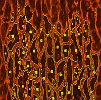
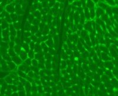
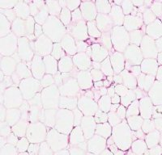
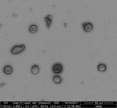

# WGA analysis

## **Identify cell area in WGA stained cells**

The WGA macro can be used to calculate cell area in *.tif or *.jpg images of tissue samples stained for cell walls. It was written for WGA stained cells. The user has the choice to analyse the whole image, using a saved ROI, making one ROI to be used for all images or to draw a seperate ROI for each image. The result ROI images will be saved in jpg format and the ROI manager results will be saved as well (as zip file) to allow control over the results.
This macro needs the plugin: Rolling Ball Background.

Download the WGA manual for help to install and run the macro.

## There are three alternative versions of this macro.

\- Version 3.1 was optimized for images from Dr Wei Ni, Diabetes Center, University of California, San Francisco.

\- Version Histo_2 optimized for images from Malgosia Kepczynska, University of Buckingham, UK using Haematoxylin& eosin Y stained adipose tissue sections.

\- Version SEM optimized for SEM image analysis for Chris Fogarty, Helsinki.

Download the WGA manual for help to install and run the macro.

## Download code

Select the file required (WGA, WGA3.1, Histo_2 or SEM ) and select "Raw" from the right side menu. Select all the code and copy and paste this into the text editor from ImageJ/Fiji (File > New > Text Window). Alternatively, you can download all files via the green "Code" button as a ZIP file and extract the macro files. Save these files in your macros sub-folder within the ImageJ or Fiji folder.

## Disclaimer

All the macros published on this repository can be used at your own risk. Although I did my best to ensure that they run as intended, there may be bugs, not expected use or changes to the ImageJ code that results in unexpected behaviour. If you notice a problem with any of the macros please let me know and I can try to solve the problem.

## Publications acknowledging this macro:

Paddock SJ, Swift SK, Alencar-Almeida V, Kenarsary A, Alvarez-Argote S, Flinn MA, Patterson M, O'Meara CC (2021) IL4Rα signaling promotes neonatal cardiac regeneration and cardiomyocyte cell cycle activity. J Mol Cell Cardiol. 161:62-74.

Marck PV, Pessoa MT, Xu Y, Kutz LC, Collins DM, Yan Y, King C, Wang X, Duan Q, Cai L, Xie JX, Lingrel JB, Xie Z, Tian J, Pierre SV (2021) Cardiac Oxidative Signaling and Physiological Hypertrophy in the Na/K-ATPase α1s/sα2s/s Mouse Model of High Affinity for Cardiotonic Steroids. *International Journal of Molecular Sciences*. 22:3462. 

Ni W, Watts SW, Ng M, Chen S, Glenn DJ, Gardner DG (2014) Elimination of vitamin D receptor in vascular endothelial cells alters vascular function. Hypertension. 64:1290-1298.
